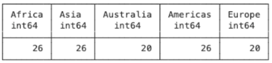
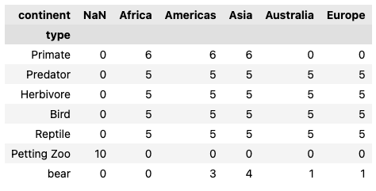
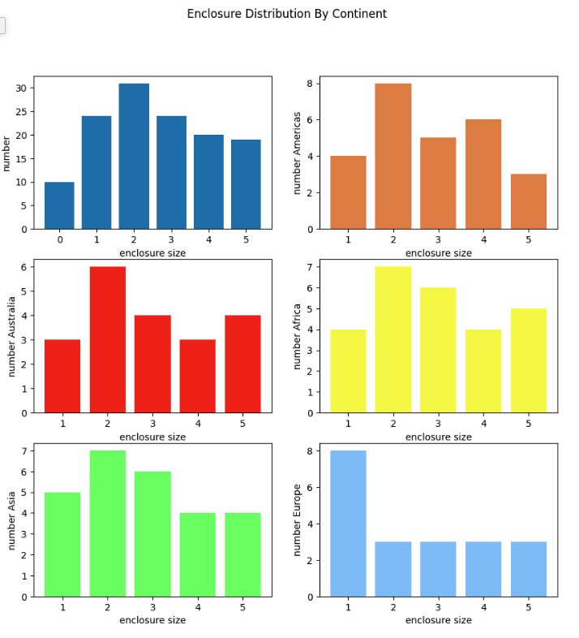
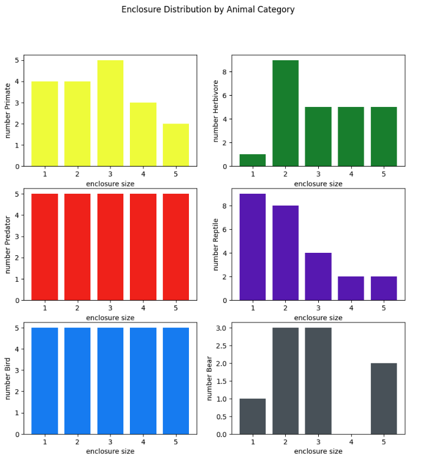
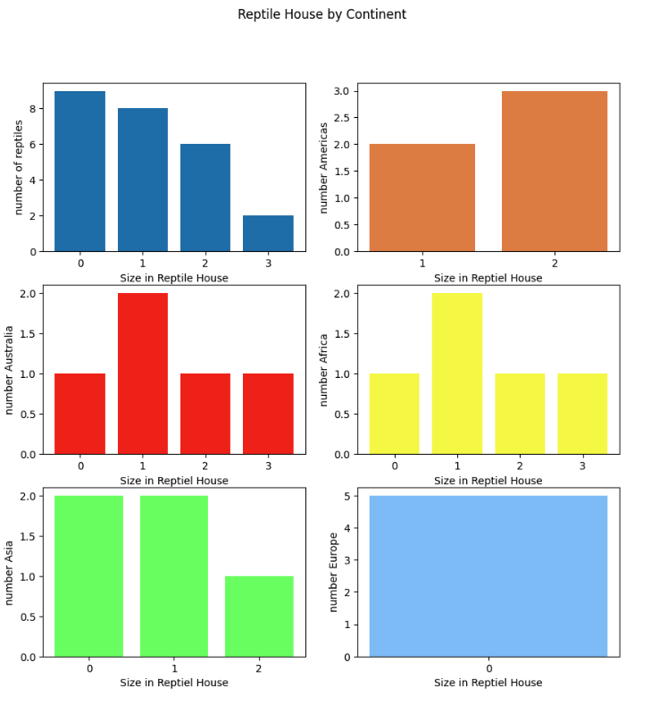
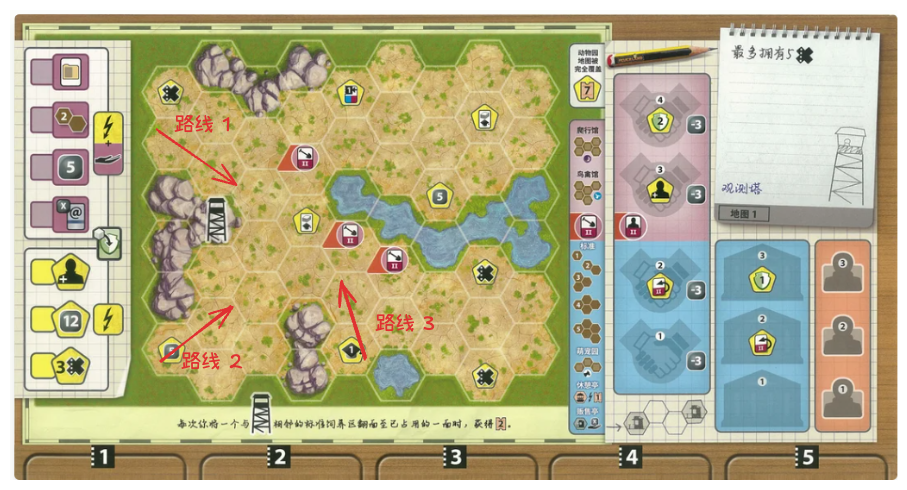
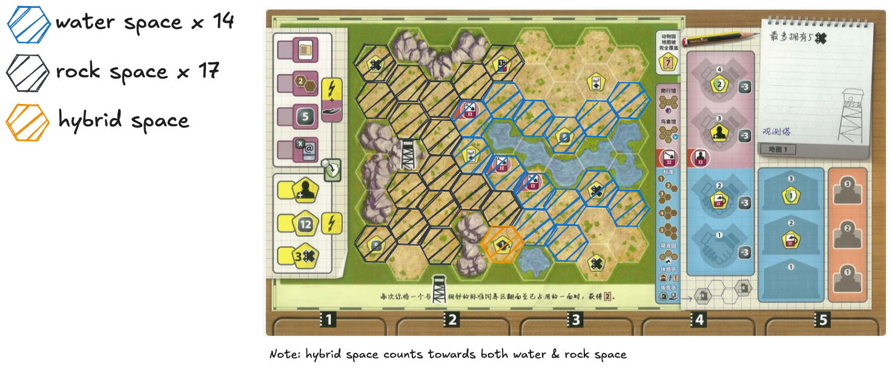

# Ark Nova to the Next Level

*Table of contents:*
- [Ark Nova to the Next Level](#ark-nova-to-the-next-level)
- [前言](#前言)
  - [Chapter 1 有用的数据](#chapter-1-有用的数据)
    - [1.1 各大洲动物分布如何?](#11-各大洲动物分布如何)
    - [1.2 各大洲的动物都住什么样的房子?](#12-各大洲的动物都住什么样的房子)
    - [1.3 各种类型动物都住什么样的房子?](#13-各种类型动物都住什么样的房子)
    - [1.4 Reptile House分析](#14-reptile-house分析)
    - [1.5 Large Bird Aviary分析](#15-large-bird-aviary分析)
  - [Chapter 2 地图分析](#chapter-2-地图分析)
    - [2.1 Observation Tower](#21-observation-tower)

# 前言

仅限于基础包的讨论

## Chapter 1 有用的数据

### 1.1 各大洲动物分布如何?

各个大洲的动物数量分布图如下，其中Africa, Asia和America相较于Europe and Austria要多六只动物，且这些动物都是猴子;

讨论了各个大洲的动物数量，再drill into每个大洲的species distribution.

由此可以得到几个Observation
- 非洲 = 美洲 = 亚洲 = 26 > 欧洲 = 澳洲 = 20
  - Implication: 欧洲和澳洲的任务会相对难做一点，比如昨天晚上第二局欧洲和澳洲都存在的情况。本来base project里, 没有一个动物有两个不同的continent icon.也就是没办法一箭双雕，一个动物同时做两个project (like 美洲 + 猴子 base project). 所以你在大方向的思路，就是后期这俩任务最好一个做max，另一个做min (提前拿奖励), 而不是两手抓，两手都抓不住. Never chase two rabbits.
- 小动物一共10只
- 猴子只住美洲，非洲，亚洲. 每个州6 each. 
  - Implication: 猴子相对于其它动物，强度偏高。个人体感是bear = bird > monkey > predator = herb >> reptile. 
没有非洲的熊，但熊主要在america and asia, 3,4 each

### 1.2 各大洲的动物都住什么样的房子?

有用的结论如下:
- 根据左上角的图，size 2的动物最多，此结论对除了欧洲外的大洲都适用
    - Implication: 所以即使你没有拥有size 2动物in hand, 需要盲build, 那么建造size 2 or 3是更优解. 盲3风险更低，但多2块
    - Implication: project的奖励的size 2 enclosure就更有吸引力了，除了帮你铺满地图，同时也未雨绸缪为了以后的地
欧洲全是1格的动物

对于打法的，我推荐
- 如果打4格动物，能造5就不造4; 且尽量挨着水和石头
  - 因为release project如果出现，你release size 4的动物, 你map没有size 4只有size 5 enclosure, 那么就你就会free你size 5 enclosure, 为后期别的大动物蓄力; size 5挨着水和石头，也是未雨绸缪，能缓解万一你后期抓到大动物也打不出来的尴尬(昨天晚上第二局，commerical harbour我提前预留了右边的挨着水和石头的size 5, 然后card到了需要水的亚洲象，就正好能打出来了 ); 且动物强度和建造条件(cost, enclosure size, requirement, water/rock)成正比

### 1.3 各种类型动物都住什么样的房子?

由此可以得到几个Observation
- 大多数reptile都是1,2
  - Implication: reptile不强力，但(base project is reptile, or手上有reptile任务）还是可以打的，如果没办法只能盲造挨着水和石头的size 2为最优解
Herbivore里size 2最多

### 1.4 Reptile House分析

这是reptile住在reptile house中的distribution, 建造reptile house时候，可以选择把所有符合条件的reptile挪到reptile house.
- 绝大多数爬行动物都是size 0
- 欧洲都是size 0

### 1.5 Large Bird Aviary分析

略，意义不大，因为,
- 不是所有鸟都能住bird aviary
- 基本没有住满过bird aviary, 除非打鸵鸟
- 强力鸟在aviary都只占一格

## Chapter 2 地图分析

总结所有地图

|map_name|total_space|water_space|rock_space|
|-|-|-|-|
|observation tower|42|15|17|

### 2.1 Observation Tower

Observation tower是一张比较中规中矩的地图，地图技能如下

> 技能
> 与观测塔周围相邻的standard enclosure住进动物的那一刻，获得 2AP.

在前期1-2AP,就能提升 1 income, 而且前期的金钱收入是非常重要的，所以你build的思路最好优先满足吃满奖励, 因此就有了三个常规方向。同时你又需要尽早吃到5声望，所以你建造路线的终点/起点是1 reputation在地图中间底部。

- `路线 1`: 左上
- `路线 2`: 左上
- `路线 3`: 左上

